# Visual Design Diagrams

This document contains visual diagrams showing the app's architecture, navigation flow, and feature locations.

---

## App Navigation Flow

```mermaid
graph TD
    A[App Start] --> B{User Authenticated?}
    B -->|No| C[Auth Page]
    C --> D[Login/Signup]
    D --> E[Home Page]
    B -->|Yes| E
    
    E --> F[Bottom Navigation]
    F --> G[Home Feed]
    F --> H[Chat]
    F --> I[Huddle]
    F --> J[Camera/Webdrop]
    
    E --> K[Top Bar]
    K --> L[Profile]
    K --> M[Search]
    K --> N[Notifications]
    
    E --> O[Lisa Voice Button]
    O --> P[Voice Commands]
    O --> Q[AI Companion Chat]
    
    L --> R[Profile Settings]
    R --> S[Lisa Settings]
    R --> T[Notification Preferences]
    R --> U[Account Settings]
    
    S --> V[Voice Settings]
    S --> W[Personality Settings]
    S --> X[Advanced Settings]
    S --> Y[Voice Library]
    S --> Z[Language Settings]
```

---

## Page Structure Overview

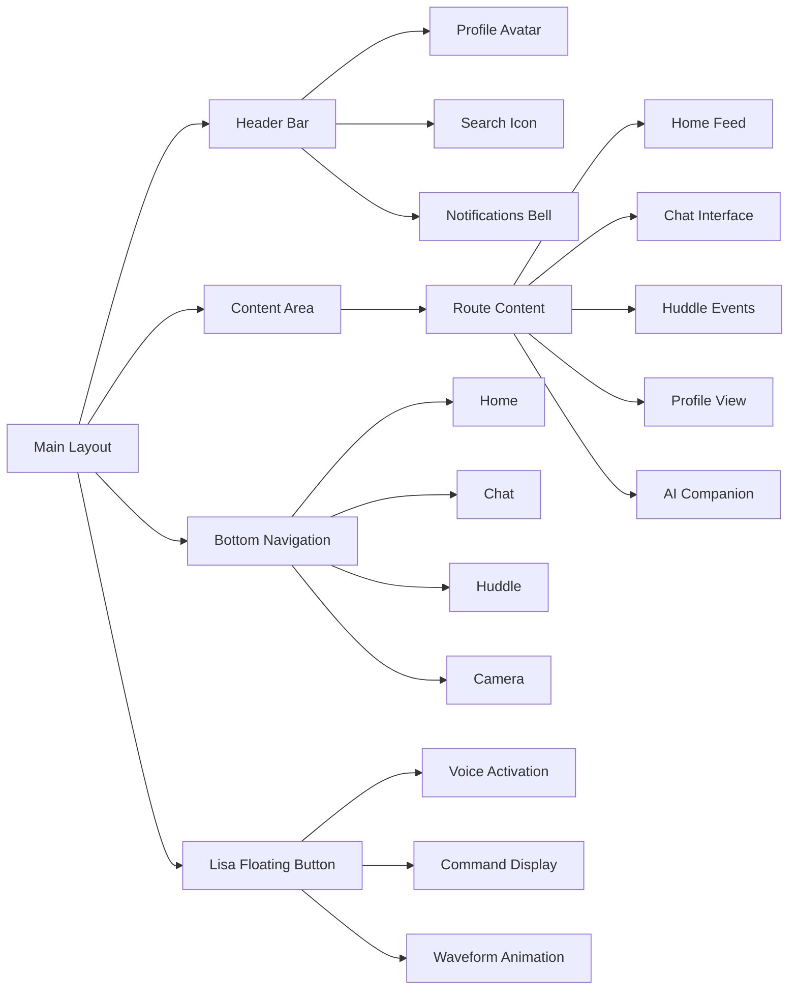

---

## Home Page Layout

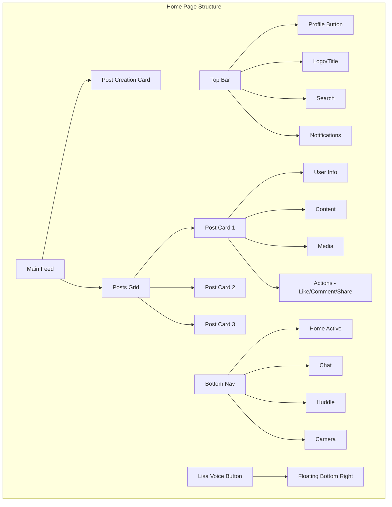

---

## Profile Page Architecture

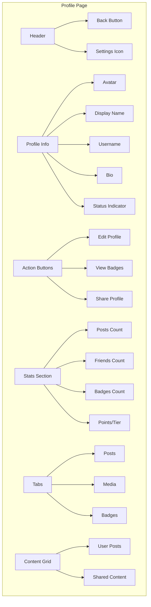

---

## Chat Interface Structure

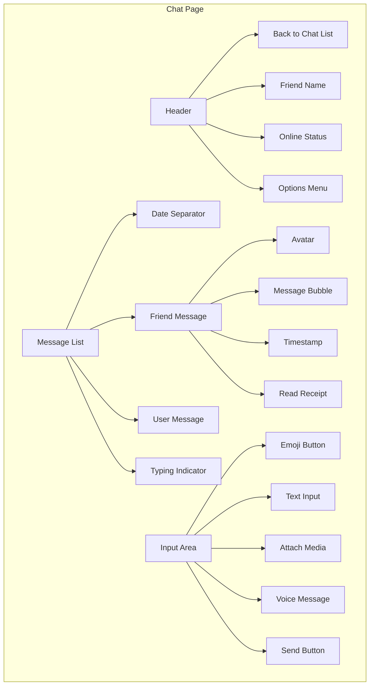

---

## Huddle Events System

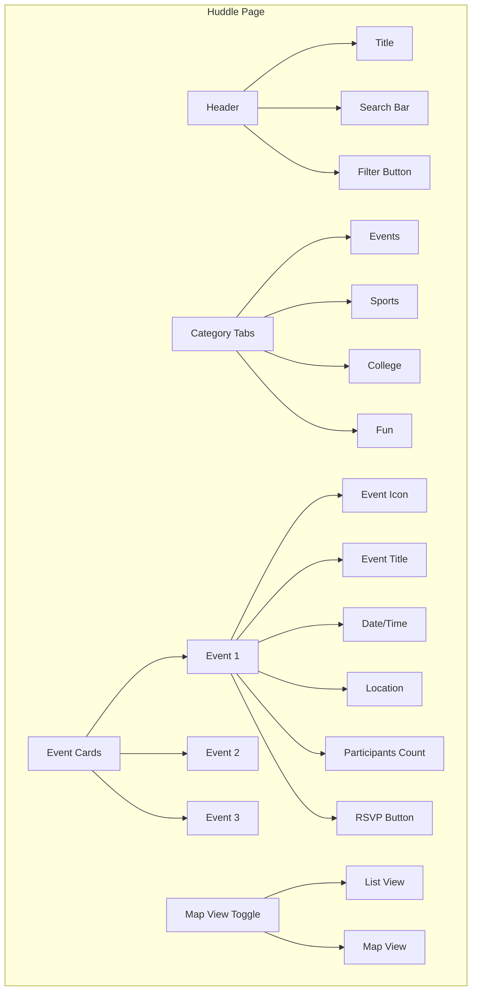

---

## AI Companion Chat Flow

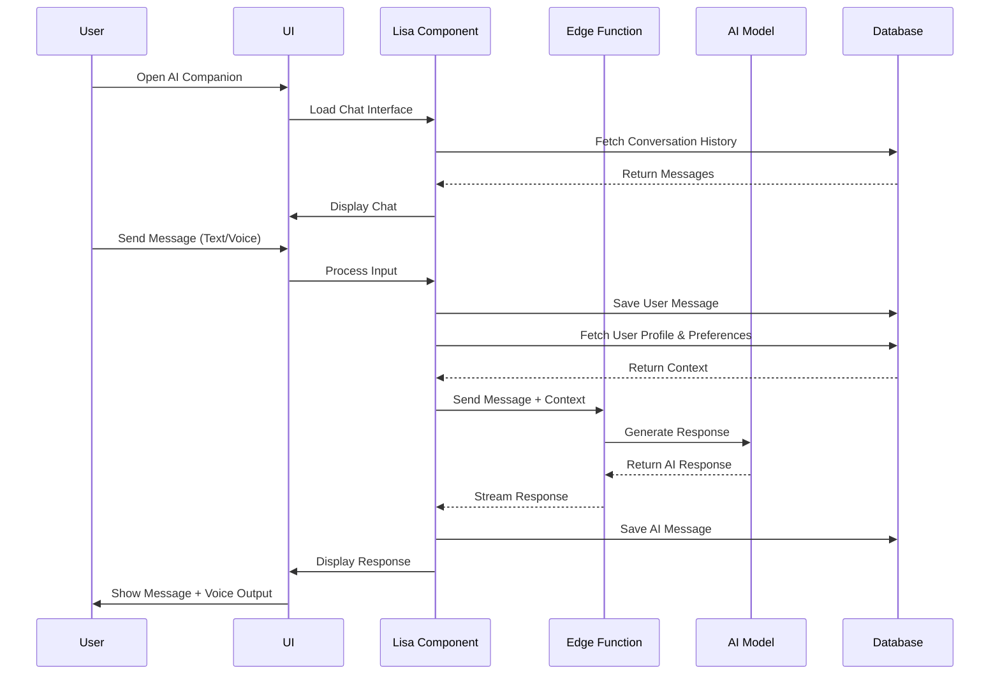

---

## Lisa Voice Command Processing

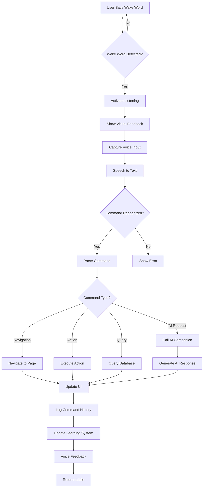

---

## Notification System Architecture

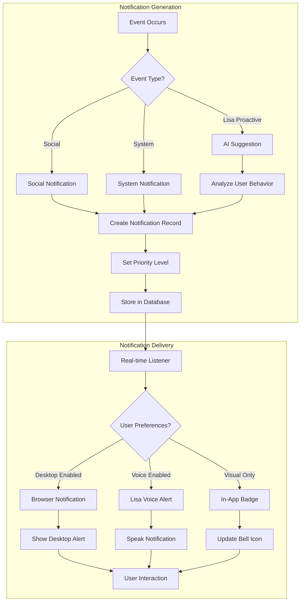

---

## Gamification System Flow

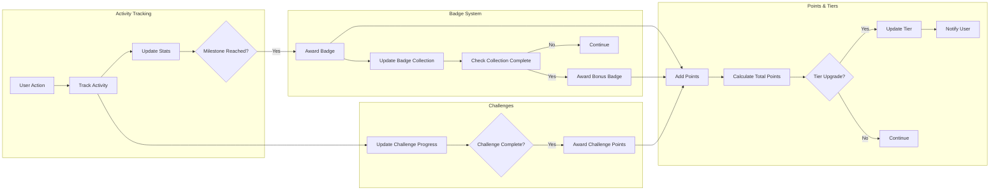

---

## Database Schema Overview

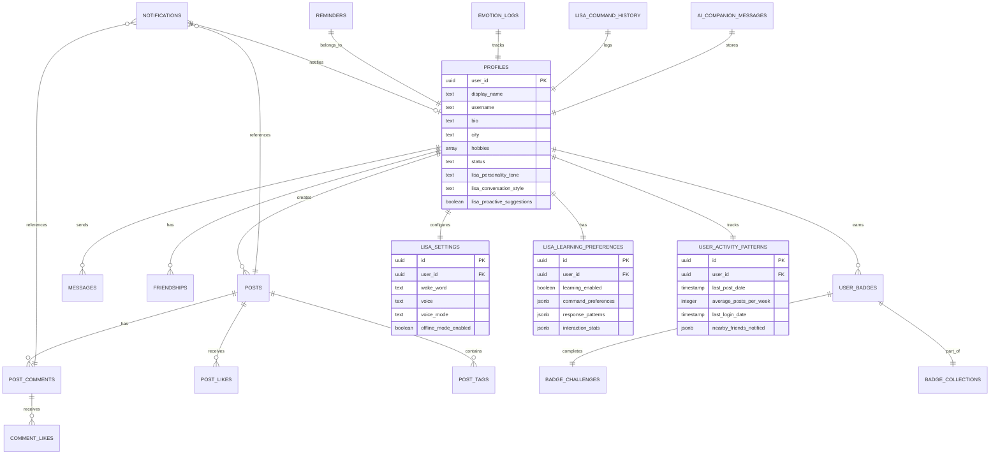

---

## Feature Location Map

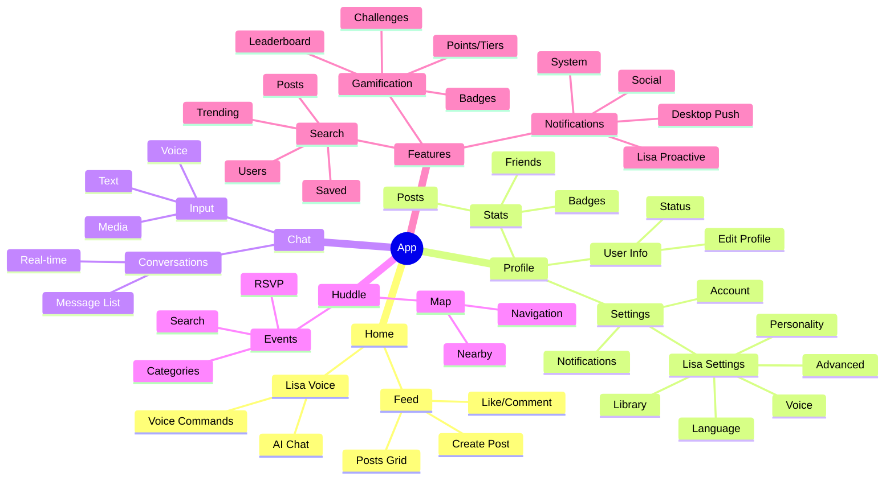

---

## Lisa AI Integration Points

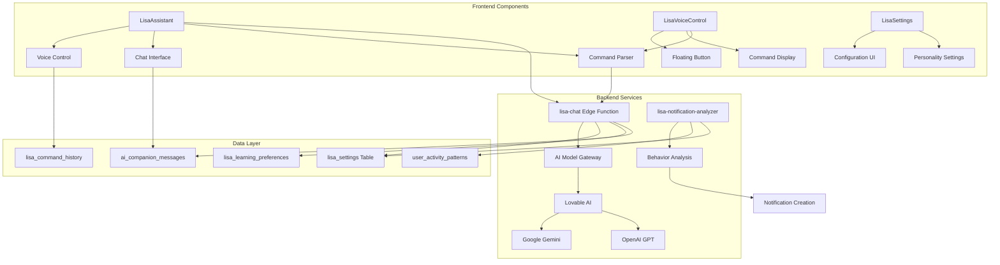

---

## Real-time Data Flow

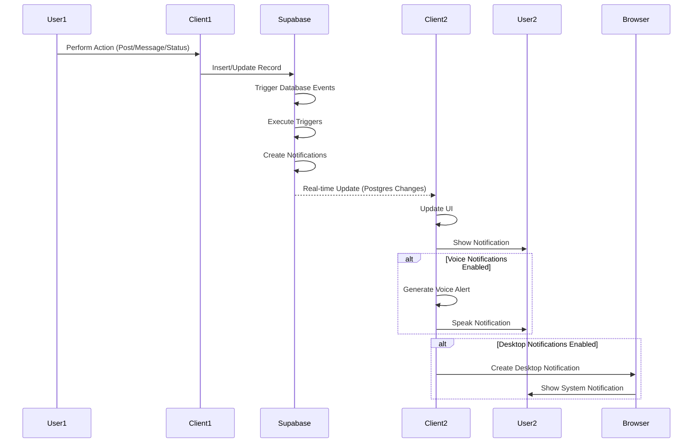

---

## Mobile vs Desktop Layout

```mermaid
graph TB
    subgraph "Mobile Layout - 320-768px"
        M1[Single Column]
        M2[Bottom Navigation]
        M3[Hamburger Menu]
        M4[Collapsed Sidebar]
        M5[Full Width Content]
        M6[Stacked Cards]
    end
    
    subgraph "Tablet Layout - 769-1024px"
        T1[Two Column Grid]
        T2[Bottom Navigation]
        T3[Expanded Sidebar]
        T4[Wider Content]
        T5[Side-by-Side Cards]
    end
    
    subgraph "Desktop Layout - 1025px+"
        D1[Three Column Grid]
        D2[Left Sidebar]
        D3[Center Content]
        D4[Right Sidebar]
        D5[Full Navigation Bar]
        D6[Multi-Column Cards]
    end
    
    A[Responsive Design System] --> M1
    A --> T1
    A --> D1
```

---

## Security & Privacy Architecture

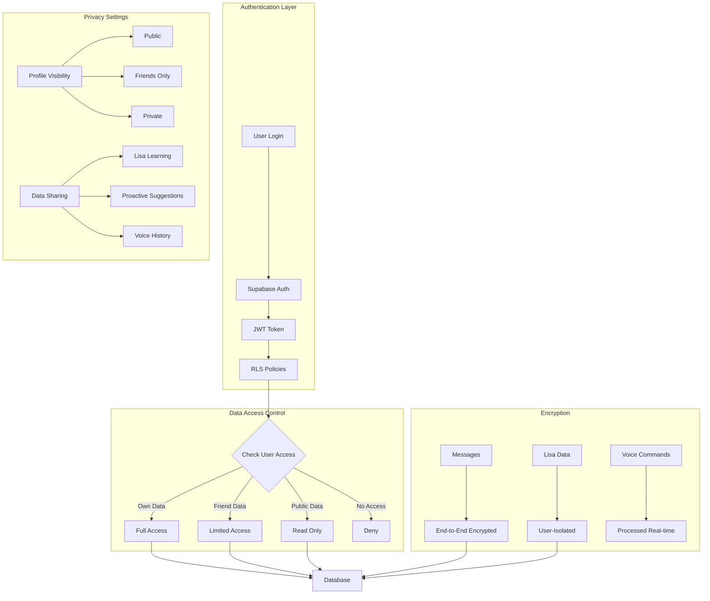

---

## Performance Optimization Strategy

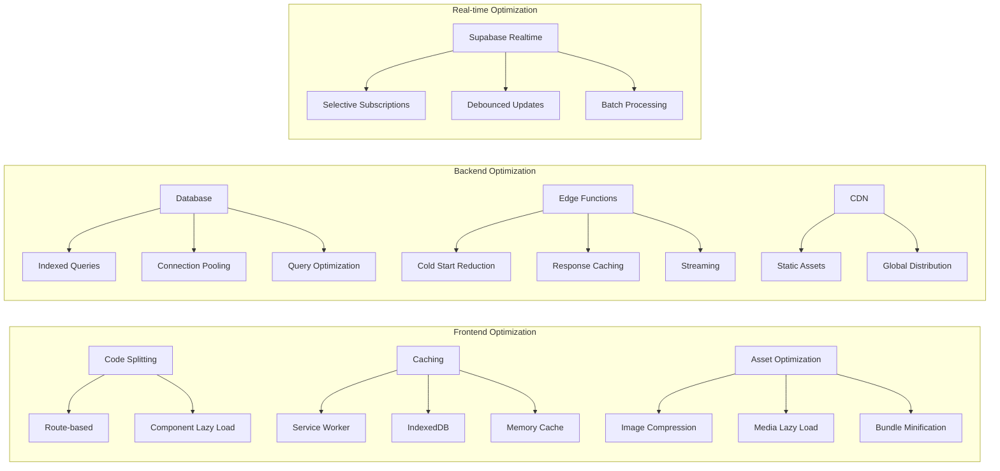

---

*These diagrams provide a comprehensive visual overview of the app's architecture, navigation flow, and feature locations. Use them as a reference for understanding how different parts of the system work together.*